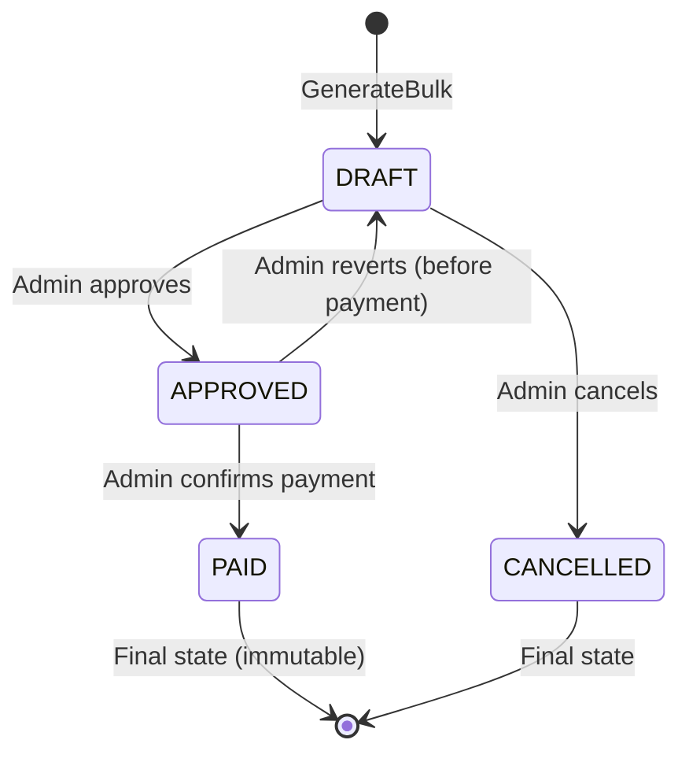

# MVP-41: Payroll State Machine Hardening

**Estimasi**: 1 hari  
**Impact**: 🔴 TINGGI — Financial Integrity

---

## 1. Problem

Current `isValidStatusTransition` allows self-transitions:
```go
transitions := map[string][]string{
    "DRAFT":    {"APPROVED", "DRAFT"},    // ← DRAFT→DRAFT allowed (why?)
    "APPROVED": {"PAID", "APPROVED"},     // ← APPROVED→APPROVED allowed
    "PAID":     {"PAID"},                 // ← PAID→PAID allowed
}
```

Additional issues:
1. **No CANCELLED state** — paid payroll cannot be voided
2. **No `approved_by`/`paid_at` tracking** — no audit trail on WHO approved
3. **APPROVED payroll can still be edited** — no lock mechanism
4. **No REJECTED state** — reviewer cannot send back to drafting

## 2. Target State Machine



### Transition Rules

| From | To | Who | Conditions |
|------|-----|-----|-----------|
| DRAFT | APPROVED | ADMIN/SUPER_USER | All payroll items valid |
| DRAFT | CANCELLED | ADMIN/SUPER_USER | - |
| APPROVED | PAID | ADMIN/SUPER_USER | Payment confirmed |
| APPROVED | DRAFT | ADMIN/SUPER_USER | Revert before payment |
| PAID | (none) | - | Immutable |
| CANCELLED | (none) | - | Immutable |

## 3. Implementation Steps

### Step 1: Migration `000015_add_payroll_approval_fields.up.sql`

```sql
ALTER TABLE payrolls ADD COLUMN IF NOT EXISTS approved_by UUID REFERENCES users(id);
ALTER TABLE payrolls ADD COLUMN IF NOT EXISTS approved_at TIMESTAMPTZ;
ALTER TABLE payrolls ADD COLUMN IF NOT EXISTS paid_at TIMESTAMPTZ;
ALTER TABLE payrolls ADD COLUMN IF NOT EXISTS cancelled_at TIMESTAMPTZ;
ALTER TABLE payrolls ADD COLUMN IF NOT EXISTS notes TEXT DEFAULT '';
```

### Step 2: Update Payroll Entity

**File**: `internal/payroll/entity/payroll.go`

Add fields:
```go
ApprovedBy  *uuid.UUID `db:"approved_by" json:"approvedBy,omitempty"`
ApprovedAt  *time.Time `db:"approved_at" json:"approvedAt,omitempty"`
PaidAt      *time.Time `db:"paid_at" json:"paidAt,omitempty"`
CancelledAt *time.Time `db:"cancelled_at" json:"cancelledAt,omitempty"`
Notes       string     `db:"notes" json:"notes"`
```

### Step 3: Harden `isValidStatusTransition`

```go
func isValidStatusTransition(currentStatus, newStatus string) bool {
    transitions := map[string][]string{
        "DRAFT":     {"APPROVED", "CANCELLED"},
        "APPROVED":  {"PAID", "DRAFT"},
        "PAID":      {},           // immutable
        "CANCELLED": {},           // immutable
    }

    allowed, exists := transitions[currentStatus]
    if !exists {
        return false
    }

    for _, s := range allowed {
        if s == newStatus {
            return true
        }
    }
    return false
}
```

### Step 4: Lock APPROVED/PAID Payrolls from Edits

Add validation in any `UpdatePayroll` method:
```go
if payroll.Status != "DRAFT" {
    return errors.New("only DRAFT payrolls can be edited")
}
```

### Step 5: Track Approval Metadata in `UpdateStatus`

```go
func (s *payrollServiceImpl) UpdateStatus(ctx context.Context, id string, req *dto.UpdatePayrollStatusRequest) error {
    // ... existing validation ...
    
    now := time.Now()
    switch req.Status {
    case "APPROVED":
        payroll.ApprovedBy = &req.UserID  // from JWT claims
        payroll.ApprovedAt = &now
    case "PAID":
        payroll.PaidAt = &now
    case "CANCELLED":
        payroll.CancelledAt = &now
    }
    
    // Save with new fields
    err = s.payrollRepo.UpdateStatus(ctx, payrollUUID, req.Status)
    // Also update approval fields...
}
```

### Step 6: Update `UpdatePayrollStatusRequest` DTO

Add `UserID` field (populated from JWT claims by the handler):
```go
type UpdatePayrollStatusRequest struct {
    Status string    `json:"status" validate:"required,oneof=APPROVED PAID CANCELLED DRAFT"`
    Notes  string    `json:"notes"`
    UserID uuid.UUID `json:"-"` // populated by handler from JWT
}
```

## 4. Files Changed

| # | File | Change |
|---|------|--------|
| 1 | `database/migrations/000015_*` | Add approval/payment tracking columns |
| 2 | `internal/payroll/entity/payroll.go` | Add `ApprovedBy`, `ApprovedAt`, `PaidAt`, `CancelledAt`, `Notes` |
| 3 | `internal/payroll/service/payroll_service_impl.go` | Harden transitions, track metadata, lock edits |
| 4 | `internal/payroll/dto/payroll_dto.go` | Update status request DTO |
| 5 | `internal/payroll/handler/payroll_handler.go` | Pass UserID from JWT to DTO |
| 6 | `internal/payroll/repository/` | Update queries to include new columns |

## 5. Verification

```bash
go build ./...
# Test transitions:
# DRAFT → APPROVED ✅
# DRAFT → PAID ❌ (should fail)
# APPROVED → PAID ✅
# PAID → anything ❌ (should fail)
```
