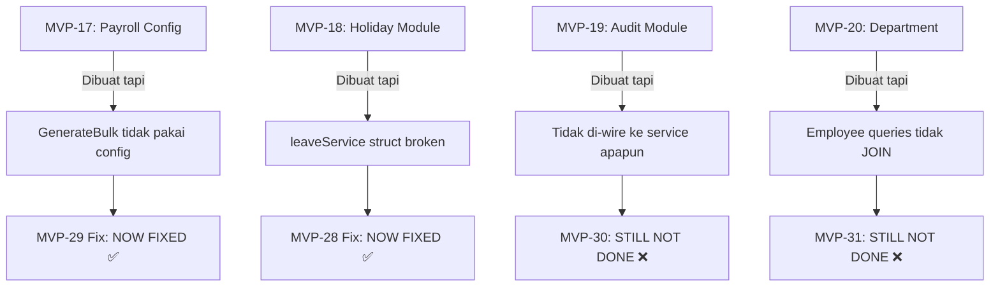

# 🔍 Strategic Audit Report — 31 MVPs HRIS SaaS

**Date**: 11 February 2026  
**Role**: Senior Product Strategist, System Architect, Execution Auditor  
**Product**: SaaS HRIS untuk UMKM  
**Stack**: Go (Fiber) + PostgreSQL + MongoDB + KeyDB + MinIO  
**Build Status**: ❌ **Tidak bisa compile** (6 errors)

---

## A. Executive Summary

### Verdict: 🟡 PARTIALLY FUNCTIONAL — SIGNIFICANT GAPS

Dari 31 MVP yang diklaim "selesai":

| Status | Count | % |
|--------|-------|---|
| ✅ Benar-benar berfungsi | 17 | 55% |
| ⚠️ Ada tapi tidak terintegrasi | 6 | 19% |
| 🔴 Compile error / broken | 5 | 16% |
| 🟡 Terlalu dangkal | 3 | 10% |

**Masalah terbesar bukan di fitur, tapi di FONDASI:**

> [!CAUTION]
> **TIDAK ADA MULTI-TENANCY.** Ini diklaim sebagai SaaS/PaaS untuk UMKM, tetapi ZERO referensi `tenant_id` atau `company_id` di seluruh codebase. **Semua data dari semua tenant akan tercampur dalam 1 database tanpa isolasi.** Ini bukan fitur yang "ditambahkan nanti" — ini adalah fondasi arsitektur yang harus ada sejak awal.

> [!WARNING]
> **APP TIDAK BISA COMPILE.** Ada 6 compile error aktif yang berarti tidak ada cara untuk menjalankan atau deploy app ini. Artinya, testing apapun yang diklaim di completion report **tidak mungkin benar**.

---

## B. Temuan Masalah Eksekusi

### B.1. Compile Errors (BLOCKER)

| File | Error |
|------|-------|
| `attendance/repository/attendance_repository.go:43` | Extra `}` — syntax error |
| `payroll/entity/payroll_config.go:18` vs `payroll.go:20` | `PayrollItem` redeclared |
| `attendance/dto/report_response.go:3` | Unused `import "time"` |
| `audit/repository/audit_repository.go:7` | Unused `import "uuid"` |
| `audit/repository/audit_repository_impl.go:5-9` | 4 unused imports |
| `holiday/repository/holiday_repository.go:7` | Unused `import "uuid"` |

**Hidden compile errors** (akan muncul setelah yang di atas diperbaiki):
- `payroll_service_impl.go` uses `payrollconfigrepository` dan `zap` tapi **tidak import** keduanya

### B.2. Feature Integration Failures

| MVP | Diklaim | Realita |
|-----|---------|---------|
| MVP-22/29 | Payroll config-based calculator | ✅ Fixed — `CalculateSalaryFromConfig` dipakai |
| MVP-23/28 | Holiday-Leave integration | ✅ Fixed — `holidayRepo` field ditambah |
| **MVP-24/30** | **Audit trail integration** | **❌ TIDAK DIKERJAKAN — zero `auditService` di payroll/leave** |
| **MVP-25/31** | **Employee dept consistency** | **❌ TIDAK DIKERJAKAN — `Create/Update` tanpa `department_id`, 4/6 query tanpa JOIN** |
| **MVP-27** | **Employee FullName in reports** | **❌ Entity punya `FullName`, repo struct TIDAK — tidak pernah di-SELECT** |

### B.3. Code Quality Issues

#### Dashboard — N+1 Query Nightmare
```go
// dashboard_service.go — membuat 10 query individual untuk 1 endpoint:
_ = s.pool.QueryRow(ctx, `SELECT COUNT(*) FROM attendances WHERE date = $1 AND status = 'PRESENT'`, today).Scan(&todayPresent)
_ = s.pool.QueryRow(ctx, `SELECT COUNT(*) FROM attendances WHERE date = $1 AND status = 'LATE'`, today).Scan(&todayLate)
_ = s.pool.QueryRow(ctx, `SELECT COUNT(*) FROM attendances WHERE date = $1 AND status = 'ABSENT'`, today).Scan(&todayAbsent)
_ = s.pool.QueryRow(ctx, `SELECT COUNT(*) FROM attendances WHERE date = $1 AND status = 'LEAVE'`, today).Scan(&todayLeave)
// ... 6 more queries
```
**Bisa 1 query:**
```sql
SELECT status, COUNT(*) FROM attendances WHERE date = $1 GROUP BY status
```

#### Audit Query Builder — Akan CRASH
```go
// string(rune('0'+argNum)) — BROKEN untuk argNum > 9
// rune('0'+10) = ':' bukan "10"
query += ` AND user_id = $` + string(rune('0'+argNum))
```

#### Error Swallowing
```go
// dashboard_service.go — semua error di-ignore
_ = s.pool.QueryRow(ctx, ...).Scan(&todayPresent)
_ = s.pool.QueryRow(ctx, ...).Scan(&todayLate)
```
Dashboard akan return semua 0 jika DB down, tanpa error indication.

### B.4. MVPs yang Terlalu Dangkal

| MVP | Masalah |
|-----|---------|
| MVP-06 (Dashboard) | Hanya summary dasar. 10 individual queries. Error di-ignore. Tidak ada time-series data, trending, atau comparison. |
| MVP-07 (Employee Self-Service) | Hanya GET `/me` — employee tidak bisa update profile sendiri, tidak bisa upload foto |
| MVP-19 (Audit Trail) | Module lengkap tapi **tidak dipanggil oleh siapapun**. Audit table selalu kosong. |

### B.5. MVPs yang Overengineered untuk Tahap Ini

| MVP | Concern |
|-----|---------|
| Overtime module (MVP-04 area) | Full OT policy engine dengan ClockIn/ClockOut, calculation, approval flow — sangat kompleks untuk UMKM yang mungkin cukup input jam manual |
| MinIO integration | Object storage untuk UMKM terasa overkill — bisa mulai dengan local filesystem atau cloud storage langsung |

### B.6. MVPs yang Redundant

| Issue | MVPs |
|-------|------|
| "Fix" plans yang menduplikasi plan sebelumnya | MVP-30 = MVP-35, MVP-31 = MVP-34. Rencana identik dibuat ulang karena yang sebelumnya tidak dikerjakan |
| Multiple verification reports | 3 verification reports (20, 27, 31 MVPs) — seharusnya 1 living document |

---

## C. Gap Strategis yang Terlewat

### 🔴 CRITICAL — Harus Ada Sebelum Produksi

| # | Layer | Gap | Impact |
|---|-------|-----|--------|
| 1 | **Multi-Tenancy** | ZERO `tenant_id`/`company_id` di semua tabel | **SaaS tidak mungkin tanpa ini.** Semua company data tercampur. Ini bukan fitur — ini arsitektur dasar. |
| 2 | **Testing** | Hanya 2 test file (`auth_service_test.go`, `pagination_test.go`). Zero integration tests, zero API tests | Tidak ada safety net. Setiap perubahan bisa break semua fitur tanpa terdeteksi. |
| 3 | **Input Validation** | Tidak ada SQL injection protection di dynamic queries (audit). Minimal input sanitization. | Security vulnerability — terutama untuk SaaS multi-tenant |
| 4 | **Soft Delete** | Zero `deleted_at` atau `is_deleted` di semua tabel | Data hilang permanen. Tidak ada recycle bin. Tidak bisa audit "siapa hapus apa" |
| 5 | **Data Isolation** | Tidak ada Row-Level Security (RLS) atau middleware tenant filter | Jika multi-tenancy ditambah, developer bisa lupa filter tenant dan bocorkan data |

### 🟡 IMPORTANT — Harus Ada untuk v1.0

| # | Layer | Gap |
|---|-------|-----|
| 6 | **Notification System** | Tidak ada push notification, email, atau in-app notification untuk approval requests |
| 7 | **File Upload Validation** | MinIO integration ada tapi tidak ada file type/size validation |
| 8 | **Pagination Consistency** | Beberapa endpoint punya pagination, beberapa tidak (dashboard, pending requests) |
| 9 | **Health Check** | Docker healthcheck calls `/health` tapi endpoint ini tidak terlihat di routes |
| 10 | **Graceful Shutdown** | Tidak ada graceful shutdown handler — connections bisa terputus saat deploy |
| 11 | **Request ID / Correlation** | Tidak ada request tracing untuk debugging di production |
| 12 | **Rate Limiter** | In-memory limiter — **tidak berfungsi di multi-instance deployment** (harus pakai KeyDB/Redis) |
| 13 | **CORS Configuration** | Hardcoded — tidak configurable per-tenant |
| 14 | **API Versioning** | Zero versioning. Breaking changes akan langsung impact semua client. |
| 15 | **Leave Balance Auto-Init** | Tidak ada system untuk auto-generate leave balances setiap awal tahun |

### 🔵 NICE TO HAVE — Untuk Competitive Advantage

| # | Layer | Gap |
|---|-------|-----|
| 16 | **Monitoring** | Zero metrics, zero health dashboard, zero alerting |
| 17 | **Caching** | KeyDB dipakai hanya untuk token — tidak untuk hot data caching |
| 18 | **Data Export** | Tidak ada export CSV/Excel/PDF untuk payroll slips, attendance reports |
| 19 | **Webhook/Event System** | Tidak ada event-driven architecture untuk extensibility |
| 20 | **Multi-location** | `AttendanceConfig` hardcode 1 lokasi office per server — UMKM bisa punya >1 lokasi |

---

## D. MVP yang Perlu Dioptimasi (Top 5)

### 1. 🔴 Dashboard Service (MVP-06/11) — Impact: HIGH

**Kenapa kurang optimal:**
- 10 individual `QueryRow` untuk 1 endpoint — bisa 2–3 queries max
- Semua error di-swallow (`_ = s.pool.QueryRow(...)`) — dashboard return "semua 0" saat DB error
- Tidak ada caching — setiap refresh = 10 database queries
- Payroll summary pakai `WHERE status = 'DRAFT'` tanpa period filter — return data ALL TIME bukan per-period

**Risiko jika dibiarkan:**
- Response time >500ms seiring data tumbuh
- Admin thinks "0 attendance today" padahal DB timeout
- Payroll count selalu naik tanpa period boundary

**Cara meningkatkan:**
```sql
-- 1 query instead of 4 for attendance:
SELECT status, COUNT(*) FROM attendances WHERE date = $1 GROUP BY status;
-- 1 query instead of 3 for leave:
SELECT status, COUNT(*) FROM leave_requests WHERE status IN ('PENDING','APPROVED','REJECTED') AND (status = 'PENDING' OR created_at >= $1) GROUP BY status;
```
Plus: error handling, caching (KeyDB, 30s TTL), period filter on payroll.

---

### 2. 🔴 Employee Repository (MVP-25/31) — Impact: HIGH

**Kenapa kurang optimal:**
- Hanya 1 dari 6 READ queries JOIN departments — **data inkonsisten**
- `Create()`/`Update()` skip `department_id` — **fitur department tidak berguna**
- `FindByIDs()` (used by payroll batch) missing `gender`, `department_id` — **payroll report tidak lengkap**
- `FullName` ada di entity tapi tidak di repository — field never selected

**Risiko jika dibiarkan:**
- Employee list shows "no department" padahal data sudah di-assign
- Payroll slip tanpa nama lengkap — tidak valid secara hukum

**Cara meningkatkan:**
- Standardize seluruh query untuk include department JOIN
- Add `FullName` ke semua repository structs + queries
- Add `department_id` ke `Create()`/`Update()`

---

### 3. 🟡 Audit Trail (MVP-19/24) — Impact: MEDIUM-HIGH

**Kenapa kurang optimal:**
- Module lengkap tapi **ZERO caller** — audit table selalu kosong
- Query builder menggunakan `string(rune('0'+argNum))` — crash pada argNum > 9
- Menggunakan `SELECT *` — fragile terhadap schema changes
- Tidak ada retention policy — table akan grow tanpa batas

**Risiko jika dibiarkan:**
- Compliance requirement (audit trail Depnaker) tidak terpenuhi
- Data breach tidak bisa di-trace
- Query crash saat filter >9 parameters

**Cara meningkatkan:**
- Inject auditService ke payroll + leave
- Fix query builder (`fmt.Sprintf`)
- Add retention policy (auto-archive >1 year)
- Add index on `(resource_type, resource_id, created_at)`

---

### 4. 🟡 Payroll Service (MVP-03/10/22/29) — Impact: MEDIUM

**Kenapa kurang optimal:**
- `GenerateBulk` processes ALL employees in 1 transaction — jika 1 employee gagal, semua rollback
- Tidak ada status flow validation (DRAFT → APPROVED → PAID) — admin bisa langsung set PAID
- Fallback ke deprecated `CalculateSalary()` jika configs kosong — harus return error, bukan fallback
- Payroll items tidak disave saat pakai deprecated calculator
- Tidak ada payroll LOCK setelah approved — admin bisa re-generate

**Risiko jika dibiarkan:**
- 1 employee error → semua payroll gagal generate (padahal yang lain valid)
- Status bisa di-manipulasi (skip approval)
- Payroll bisa di-overwrite setelah approved

**Cara meningkatkan:**
- Per-employee error handling (skip failed, log, continue)
- State machine for payroll status
- Remove deprecated fallback
- Add payroll lock mechanism

---

### 5. 🟡 Rate Limiter (MVP-14) — Impact: MEDIUM

**Kenapa kurang optimal:**
- In-memory limiter (`limiter.New()`) — **tidak sync antar instance**
- Jika deploy 3 instance, attacker bisa kirim 300 req/min (100 per instance)
- Tidak ada per-user rate limiting — hanya per-IP
- Behind proxy, semua user punya IP yang sama (reverse proxy IP)

**Risiko jika dibiarkan:**
- Rate limiting tidak efektif di production multi-instance
- DDoS protection tidak berfungsi
- Shared IP users terlimit secara kolektif

**Cara meningkatkan:**
- Migrate ke Redis/KeyDB-based rate limiter (storage sudah ada!)
- Add per-user limiting (dari JWT claims)
- Add `X-Forwarded-For` / `X-Real-IP` parsing

---

## E. Rekomendasi MVP Baru

### 🔴 PHASE 1 — FONDASI (WAJIB sebelum launch)

| # | MVP | Deskripsi | Estimasi | Justifikasi |
|---|-----|-----------|----------|-------------|
| 32 | **Fix Compile Errors** | Perbaiki 6+ compile errors agar app bisa build | 30 min | App tidak bisa jalan |
| 33 | **Multi-Tenancy Foundation** | Tambah `company_id UUID` ke semua tabel, middleware tenant filter, RLS | 3–5 hari | **FUNDAMENTAL untuk SaaS** |
| 34 | **Company/Tenant Module** | CRUD company, subscription, admin setup | 2 hari | Diperlukan oleh multi-tenancy |
| 35 | **Soft Delete** | Tambah `deleted_at TIMESTAMP` ke semua tabel, update semua queries dengan `WHERE deleted_at IS NULL` | 2 hari | Data integrity, compliance |
| 36 | **Fix Dashboard N+1** | Gabung 10 queries jadi 2–3, add error handling, add basic caching | 3 jam | Performance + reliability |
| 37 | **Fix Audit Integration** | Wire auditService ke payroll/leave, fix query builder | 2 jam | Compliance |
| 38 | **Fix Employee Repo** | Consistent queries, dept JOIN, FullName, Create/Update | 3 jam | Data consistency |
| 39 | **Distributed Rate Limiter** | Migrate dari in-memory ke KeyDB-based rate limiter | 2 jam | Security di production |

### 🟡 PHASE 2 — PRODUCTION READY

| # | MVP | Deskripsi | Estimasi |
|---|-----|-----------|----------|
| 40 | **Notification Service** | Email + in-app notifications untuk approval flow (leave, overtime, payroll) | 3 hari |
| 41 | **Testing Foundation** | Unit tests untuk semua services, integration tests untuk critical flows (payroll, leave, auth) | 5 hari |
| 42 | **API Versioning** | `/api/v1/` prefix, versioning strategy, backward compatibility | 1 hari |
| 43 | **Graceful Shutdown** | Handle SIGTERM, drain connections, complete pending requests | 2 jam |
| 44 | **Health Check Endpoint** | `/health` + `/readiness`, dependency checks (DB, KeyDB, MongoDB) | 2 jam |
| 45 | **Request Tracing** | Request ID middleware, correlation ID, structured logging | 3 jam |
| 46 | **Payroll State Machine** | Enforce DRAFT → APPROVED → PAID flow, lock approved payrolls | 1 hari |
| 47 | **Data Export** | Export payroll slip PDF, attendance report CSV/Excel | 2 hari |

### 🔵 PHASE 3 — COMPETITIVE ADVANTAGE

| # | MVP | Deskripsi | Estimasi |
|---|-----|-----------|----------|
| 48 | **Leave Balance Auto-Init** | Auto-generate leave balances setiap awal tahun, carry-over rules | 1 hari |
| 49 | **Employee Onboarding Flow** | Guided setup: create user → employee → assign schedule → assign department | 2 hari |
| 50 | **Attendance Geofencing v2** | Multi-location support, per-schedule geofence, WiFi-based check-in | 3 hari |
| 51 | **Dashboard Analytics** | Time-series charts, attendance trends, payroll cost trends, department comparison | 3 hari |
| 52 | **Webhook/Event System** | Event bus (internal), webhook endpoints for external integration (accounting, etc) | 3 hari |
| 53 | **Caching Layer** | Cache hot data (employee list, schedules, configs) di KeyDB, invalidation strategy | 2 hari |
| 54 | **Admin Configuration Panel** | Company settings, working hours, leave policies, payroll config — all via API | 2 hari |
| 55 | **Subscription & Billing** | Plan management, seat-based pricing, usage tracking, payment integration | 5 hari |

---

## F. Roadmap Prioritas

### Execution Timeline

```
WEEK 1 — Fix Foundation (BLOCKER)
├── MVP-32: Fix compile errors (30 min)
├── MVP-36: Fix Dashboard N+1 (3 jam)
├── MVP-37: Fix Audit Integration (2 jam)
├── MVP-38: Fix Employee Repo (3 jam)
└── MVP-39: Distributed Rate Limiter (2 jam)

WEEK 2-4 — Multi-Tenancy (FUNDAMENTAL)
├── MVP-33: Multi-Tenancy Foundation (3-5 hari)
├── MVP-34: Company/Tenant Module (2 hari)
└── MVP-35: Soft Delete (2 hari)

WEEK 5-6 — Production Ready
├── MVP-42: API Versioning (1 hari)
├── MVP-43: Graceful Shutdown (2 jam)
├── MVP-44: Health Check (2 jam)
├── MVP-45: Request Tracing (3 jam)
└── MVP-46: Payroll State Machine (1 hari)

WEEK 7-8 — Quality & Testing
├── MVP-41: Testing Foundation (5 hari)
└── MVP-40: Notification Service (3 hari)

WEEK 9-10 — Value Add
├── MVP-47: Data Export (2 hari)
├── MVP-48: Leave Balance Auto-Init (1 hari)
├── MVP-49: Employee Onboarding (2 hari)
└── MVP-51: Dashboard Analytics (3 hari)

WEEK 11-12 — Advanced
├── MVP-50: Multi-location Attendance (3 hari)
├── MVP-52: Webhook/Event System (3 hari)
├── MVP-53: Caching Layer (2 hari)
└── MVP-54: Admin Config Panel (2 hari)

MONTH 4 — Monetization
└── MVP-55: Subscription & Billing (5 hari)
```

---

## G. Dependency Flow Critique

### Masalah Urutan yang Sudah Terjadi



### Pola yang Berulang

> [!WARNING]
> **"Module Created but Not Integrated" Pattern**
> 
> MVP-17 sampai MVP-20 semua membuat module baru tapi **TIDAK PERNAH mengintegrasikan** ke consumers. Ini menunjukkan pola eksekusi yang dangkal: membuat file baru tanpa memverifikasi bahwa fitur end-to-end benar-benar berfungsi.

### Urutan yang Seharusnya

Beberapa MVP dikerjakan terbalik:
1. **Multi-tenancy** seharusnya MVP-01 — semua tabel harus punya `company_id` dari awal
2. **Testing** seharusnya MVP-02 — memberikan safety net sebelum membuat fitur
3. **Soft delete** seharusnya MVP-03 — fundamental data integrity
4. Module-specific MVPs harusnya termasuk integration verification sebagai bagian dari "done"

---

## H. Critical Decision Points

### ❓ Pertanyaan yang Harus Dijawab Sebelum Melanjutkan

1. **Multi-tenancy strategy**: Shared database + `company_id` column, atau schema-per-tenant, atau database-per-tenant? Ini menentukan arsitektur seluruh sistem.

2. **Migration strategy**: Dengan 11 migration files yang sudah ada dan semua tabel tanpa `company_id`, bagaimana caranya menambah multi-tenancy tanpa break backward compatibility?

3. **Mixed DB (Postgres + MongoDB)**: Users di MongoDB, employees di Postgres. Setiap query yang butuh join user+employee harus cross-database — ini performance bottleneck. Apakah ini keputusan desain yang intentional?

4. **Definition of "Done"**: Saat ini MVP dianggap selesai saat file dibuat, bukan saat fitur end-to-end bekerja. Harus ada acceptance criteria yang jelas.

---

> [!IMPORTANT]
> **Bottom Line**: Produk ini memiliki fondasi fitur yang cukup baik (attendance, leave, payroll, overtime), tetapi **TIDAK SIAP untuk SaaS** karena tidak ada multi-tenancy, testing minimal, dan beberapa fitur tidak terintegrasi. Prioritas #1 bukan fitur baru — melainkan memperbaiki fondasi arsitektur.
